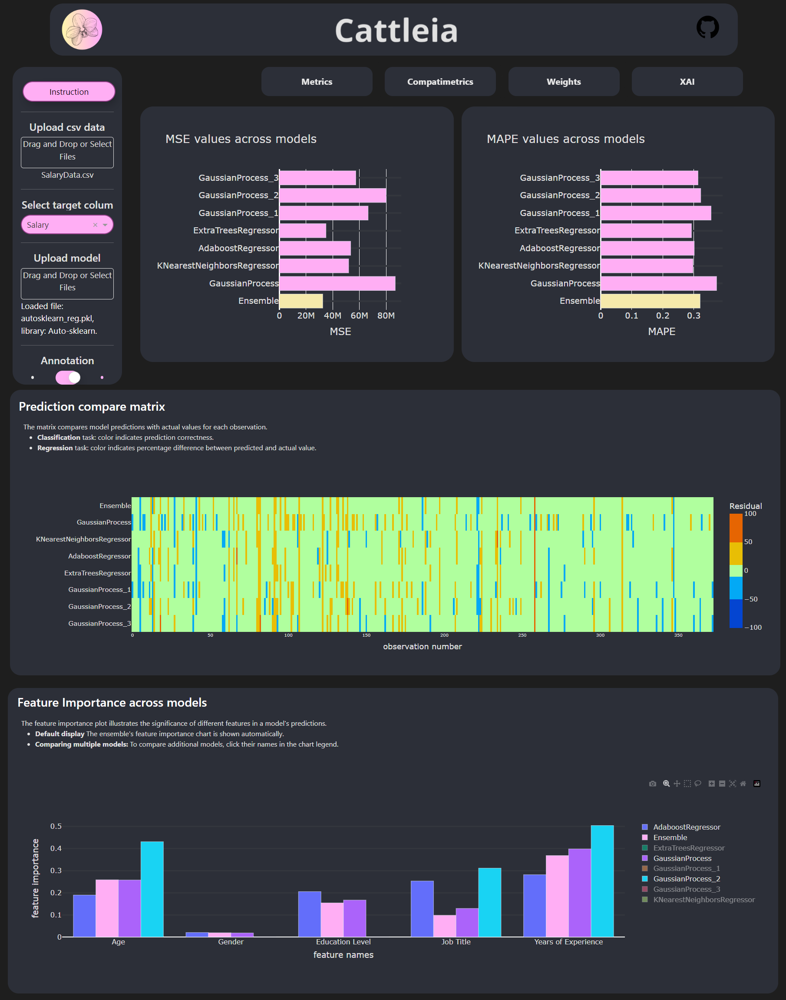

# cattleia: Complex Accessible Transparent Tool for Learning Ensemblers In AutoML


***cattleia*** is a Dash application for analysing model ensembles produced by AutoML packages in Python: [`auto-sklearn`](https://github.com/automl/auto-sklearn), [`AutoGluon`](https://github.com/autogluon/autogluon) and [`FLAML`](https://github.com/microsoft/FLAML). 

:cherry_blossom: through tables and visualizations, allows to look at the metrics of the models to assess their contribution to the prediction of the built committee

:cherry_blossom: introduces compatimetrics, which enable analysis of model similarity

:cherry_blossom: enables the analysis of weights and how they impact the model by allowing their modification

## Application Setup Guide
### System Requirements
- Linux or WSL for Windows
- Python >= 3.8

### Instruction
1. **Clone the repository:**
   ```bash
   git clone https://github.com/malwina0/cattleia.git
   ```
2. **Install dependencies:**
   ```bash
   cd cattleia
   pip3 install -r requirements.txt
   ```
3. **Start the app:**
   ```bash
   python3 app.py
   ```
4. Access the Dash app at http://127.0.0.1:8050/. Keep the server running to use the app.

## Motivation
The motivation for the research is to understand the inner workings of ensemble models and to develop new insights and techniques that can be used to improve the performance of AutoML models in tabular data prediction. The *cattleia* aims to improve the trustworthiness and interpretability of AutoML. The goal is to make this tool intuitive to use, the same time providing valuable information and analysis. 

## App demo


## Authors
This project is created as a Bachelor thesis by:
- [Dominik Kędzierski](https://github.com/D3TR0),
- [Jakub Piwko](https://github.com/jakub-piw), 
- [Malwina Wojewoda](https://github.com/malwina0).
 
Project co-ordinator and supervisor: [Anna Kozak](https://github.com/kozaka93).
