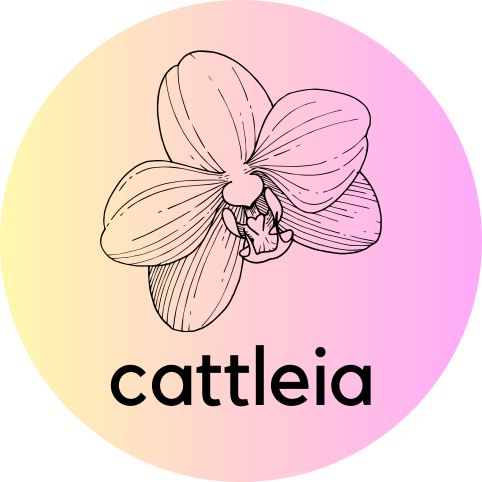

# cattleia: Complex Accessible Transparent Tool for Learning Ensemblers In AutoML

## Authors
This project is created as a Bachelor thesis by:
- [Dominik Kędzierski](https://github.com/D3TR0),
- [Jakub Piwko](https://github.com/jakub-piw), 
- [Malwina Wojewoda](https://github.com/malwina0).
 
Project co-ordinator and supervisor: [Anna Kozak](https://github.com/kozaka93)
